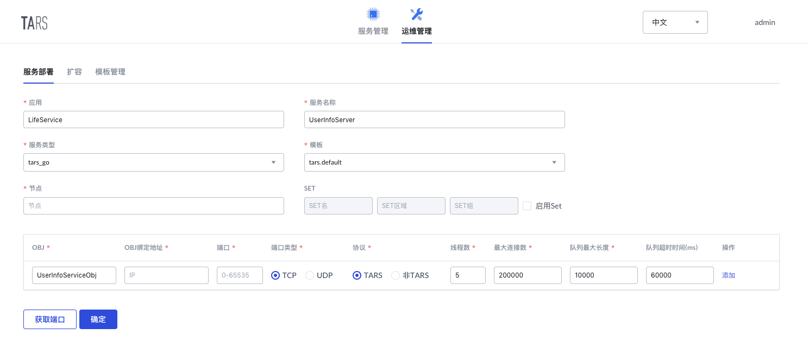

# UserInfoServer
大学生活服务平台-用户信息服务，提供用户注册，信息获取

服务接口可查看[接口文档](docs/RPC.md)
## 项目结构
```sh
UserInfoServer
├── client                  # 默认自动生成的客户端代码
│   └── client.go
├── debugtool
│   └── dumpstack.go        # 默认自动生成的debug代码
├── makefile                # 项目构建makefile文件
├── README.md
├── start.sh                # 默认启动脚本
├── UserInfoServer.conf     # 默认配置文件
├── UserInfoServer.go       # 服务实现文件
├── UserInfoServiceImp.go   # 接口实现文件
├── DataService.tars        # 数据服务tars文件
├── ServerStatus.tars       # 服务状态tars文件
├── UserInfoService.tars    # 用户信息服务tars文件
└── vendor
    ├── LifeService         # tars协议文件生成的go代码
    └── vendor.json
```

## 开发环境
* Go >= 1.9.x, 参照Go官网安装文档即可, 需要配置好GOPATH, GOROOT环境变量
* TarsGo, 参照[TarsGo文档](https://github.com/TarsCloud/TarsGo/blob/master/docs/tars_go_quickstart.md)安装TarsGo即可

## 构建方式
TarsGo服务需要在指定目录下创建和构建, 因此我们需要将项目clone到go目录下的`src/LifeService`中
```sh
mkdir -p $GOPATH/src/LifeService
cd $GOPATH/src/LifeService
git clone https://github.com/xxx/UserInfoServer.git
```
进入服务目录, 生成服务发布包
```sh
cd UserInfoServer
make tar
```

## 服务部署
### 部署信息
在Tars平台->运维管理->服务部署中，按如下信息部署服务，其中节点填写自己需要部署服务的节点

* 服务基本信息：
    * 应用名称：LifeService
    * 服务名称：UserInfoServer
    * 服务类型：tars_go
    * 模板名称：tars.default
* Obj部署信息：
    * OBJ名称：UserInfoServiceObj
    * 协议类型：TARS
    * 端口：自动生成



### 服务发布
在Tars平台->服务管理->LifeService->UserInfoServer->发布管理中，
* 选中刚刚部署的节点，点击发布选中节点
* 上传发布包，选中构建项目生成的发布包`UserInfoServer.tgz`上传
* 在发布版本中便可以找到刚刚上传的发布包并选择
* 点击发布即可完成发布
